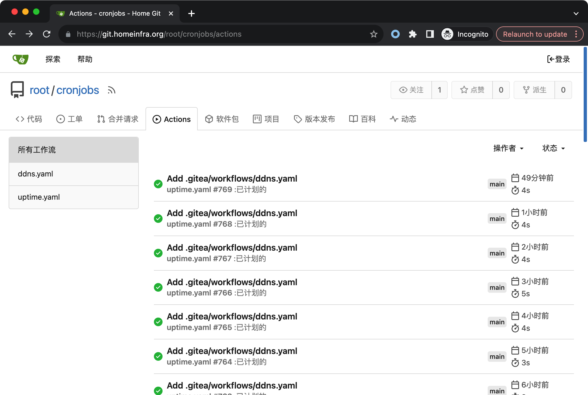
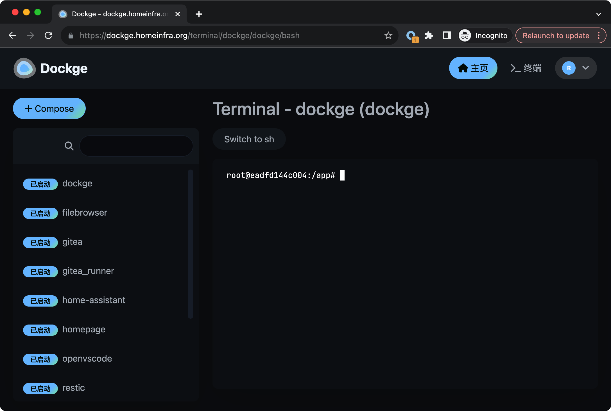
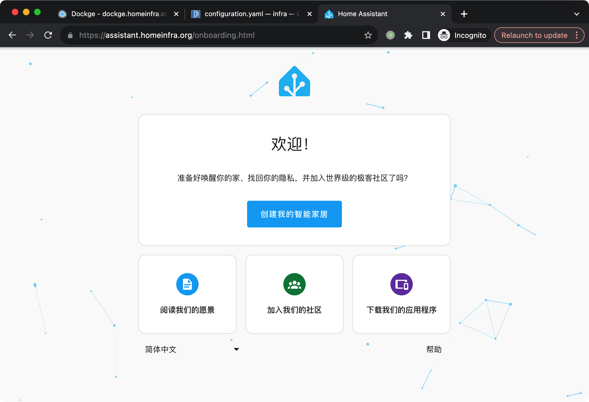
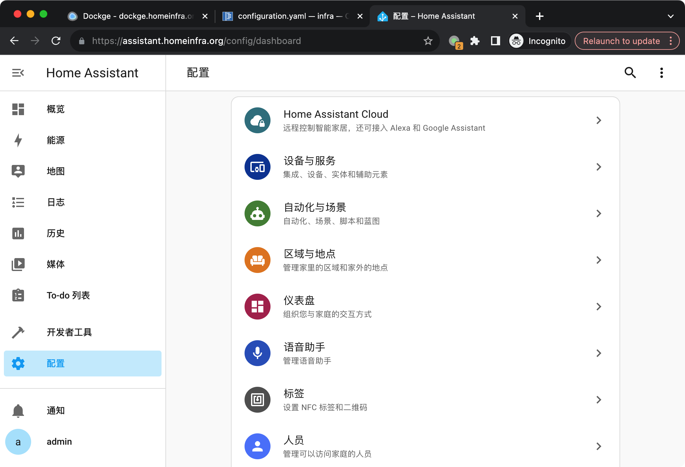
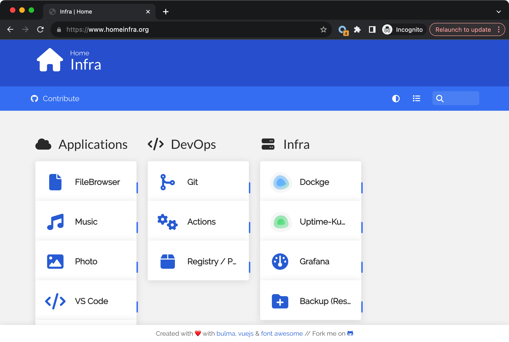
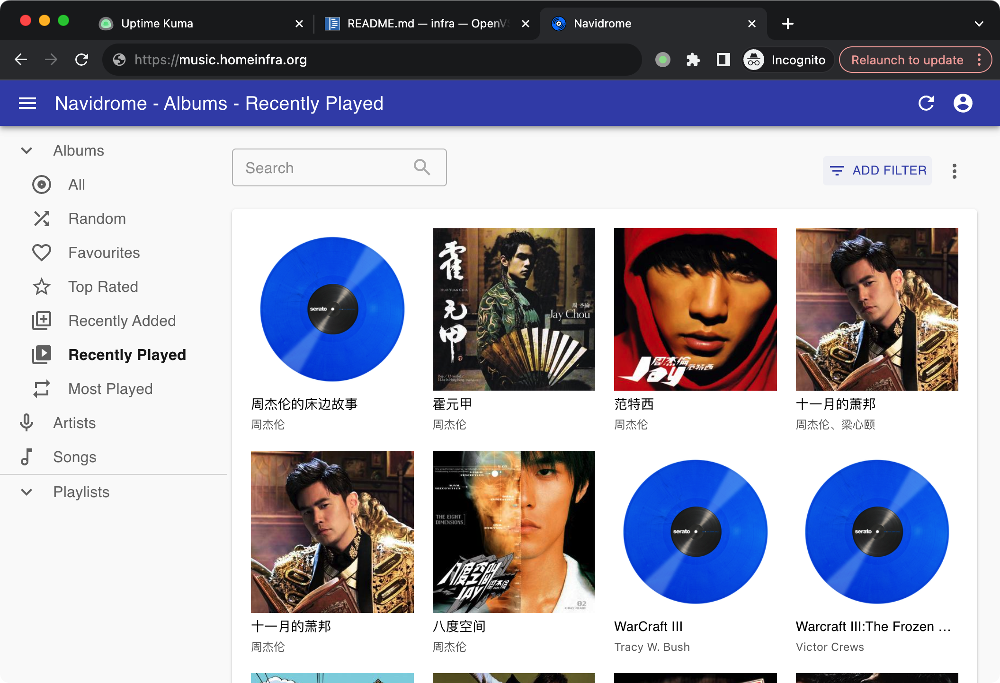
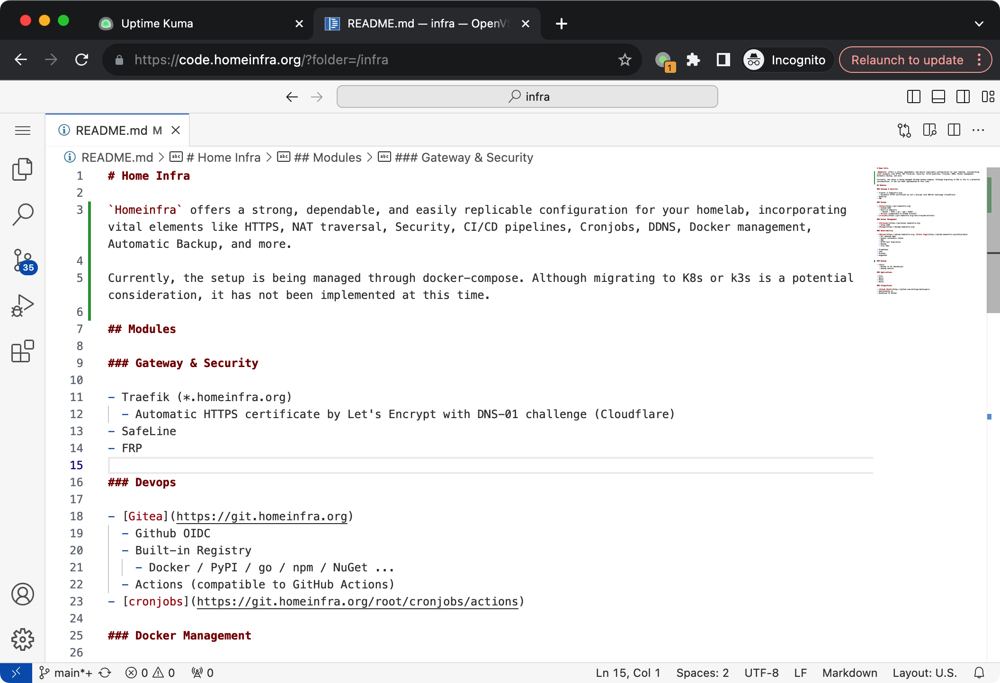
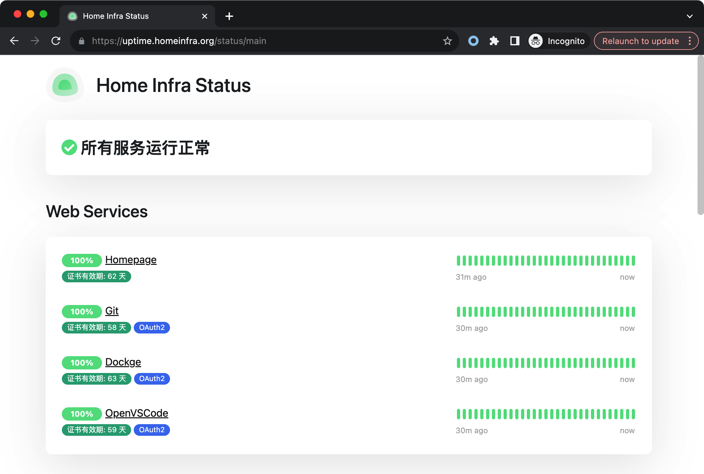

# Home Infra

`Homeinfra` offers a strong, dependable, and easily replicable configuration for your homelab, incorporating vital elements like HTTPS, NAT traversal, Security, CI/CD pipelines, Cronjobs, DDNS, Docker management, Automatic Backup, and more.

Currently, the setup is being managed through docker-compose. Although migrating to K8s or k3s is a potential consideration, it has not been implemented at this time.

<table>
  <tr>
    <td></td>
    <td></td>
    <td></td>
  </tr>
  <tr>
    <td></td>
    <td></td>
    <td></td>
  </tr>
  <tr>
    <td></td>
    <td></td>
    <td></td>
  </tr>
</table>

## Modules

### Gateway & Security

- Traefik (*.homeinfra.org)
  - Automatic HTTPS certificate by Let's Encrypt with DNS-01 challenge (Cloudflare)
- SafeLine
- FRP

### Devops

- [Gitea](https://git.homeinfra.org)
  - Github OIDC
  - Built-in Registry
    - Docker / PyPI / go / npm / NuGet ... 
  - Actions (compatible to GitHub Actions) 
- [cronjobs](https://git.homeinfra.org/root/cronjobs/actions)

### Docker Management

- [Portainer](https://portainer.homeinfra.org)
  - Gitea OIDC
- [Dockge](https://dockge.homeinfra.org)

### Observability

- [Uptime](https://uptime.homeinfra.org) [Status Page](https://uptime.homeinfra.org/status/main)
  - All exposed apps
  - Docker containers status
  - DNS
  - HTTPS Cert Expiration
  - Backup
  - Cron Jobs

- Prometheus
- Loki
- Grafana
- msgpusher

### Backup

- restic
  - Backup to S3 (Backblaze)
  - backup monitor

### Applications

- File
- Music
- Photo
- Movie

### Integrations

- [Github OAuth](https://github.com/settings/developers)
- healthchecks.io
- Backblaze S3 Bucket

